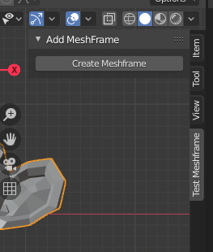

# Meshframer
Blender add-on to create stopmotion-like animation.

Main reason to do this was a test, inspired by the new developments of Pablo Dobarro's mesh keys. I thought that it was already possible to do such thing, but workflow was very painful. Using this little tool you can simulate a stopmotion session, creating and modifying new instances of your mesh, with a constant interpolation. Best of all you don't have to deal with selecting objects in outliner, add keyframes for viewport and render everytime and remembering adding the right keyframes to make objects not to overlap.

## Instructions
Install the addon, it works in Blender 2.82. 
* Select a mesh. In 3D View Panel, press "Create Meshframe" to insert a pose for the mesh.

* Modify the newly created object as you please.
* Move in the timeline, select mesh, and repeat process.
* For each "meshframe" you add, Blender will create a new object, so you don't have to worry about topology or mesh islands, you can change material, and every aspect of each object.

Selected meshes can be parented to armatures as well, making all "meshframes" created to remain parented. Objects can be animated as well. Wherever you insert a "meshframe", the original mesh object will be keyframed in viewport.

## Caveats and TODO
This is a proof of concept mainly so do not expect to be packed with features and error catching. 

* The tool will not work properly when trying to insert inbetweens, since it won't modify existing animation to make room for the "inbetween" keyframes. You will need to manually modify the keyframes in Dopesheet to fix that.
* The added objects belong to the scene collection, not the one that the original first selected object belongs.
